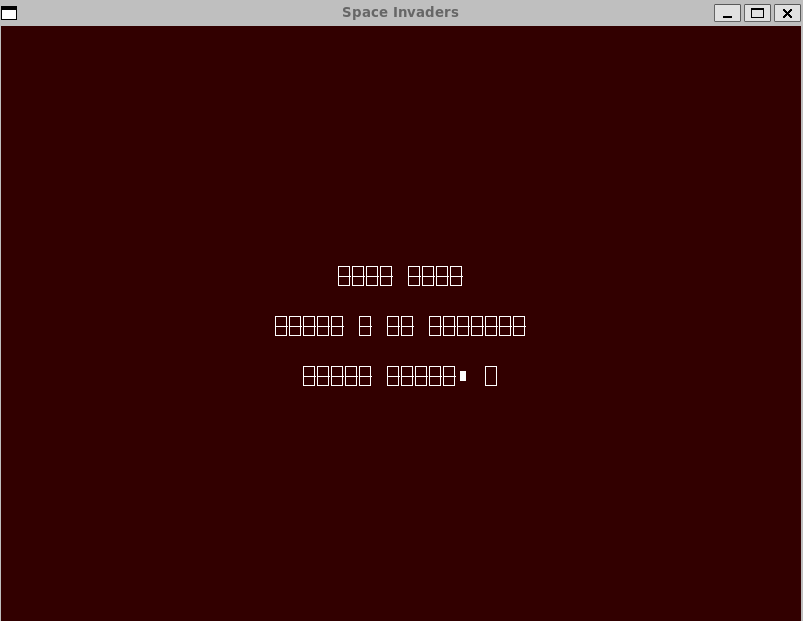

# C++ Space Invaders

A modern C++ implementation of the classic arcade game Space Invaders using SDL3 (Simple DirectMedia Layer).



## Features

- Classic Space Invaders gameplay with modern features
- Built with SDL3 for cross-platform compatibility
- Clean, modular C++23 code
- Optimised rendering and collision detection
- Support for keyboard controls
- Sound effects and optional font rendering with Sdl3\_ttf

## Requirements

- C++23 compatible compiler
- CMake 3.20 or higher
- SDL3 library
- Sdl3\_ttf library (optional, for enhanced text rendering)

## Building from Source

### Clone the Repository

```bash
git clone https://github.com/cschladetsch/CppSpaceInvaders.git
cd CppSpaceInvaders
```

### Building with CMake

```bash
$ mkdir -p build && cd build && cmake .. && build
```

### Running the Game

After building, the executable will be in the `bin` directory:

```bash
# From the build directory
./bin/CppSpaceInvaders
```

## Controls

- **Left/Right Arrow Keys**: Move the player ship
- **Space**: Shoot
- **ESC**: Pause/Exit game

## Project Structure

```
CppSpaceInvaders/
   assets/             # Game assets (sprites, sounds, fonts)
   include/            # Header files
   src/                # Source files
   CMakeLists.txt      # CMake build configuration
   .gitignore          # Git ignore file
   Readme.md           # This file
```

## Game Components

- **Player**: Controls the player ship at the bottom of the screen
- **Enemy**: Various alien invaders that move in formation
- **Bullet**: Projectiles fired by the player and enemies
- **Barrier**: Destructible shields that protect the player
- **UFO**: Special enemy that occasionally appears at the top of the screen

## Dependencies

- [SDL3](https://github.com/libsdl-org/SDL) - Simple DirectMedia Layer v3
- [SDL3\_ttf](https://github.com/libsdl-org/SDL_ttf) - SDL3 TrueType Font library (optional)

## Building SDL3 from Source

If SDL3 is not available in your package manager, you can build it from source:

```bash
git clone https://github.com/libsdl-org/SDL.git -b SDL3
cd SDL
mkdir build
cd build
cmake ..
cmake --build .
sudo cmake --install .
```

## License

This project is licensed under the MIT License - see the LICENSE file for details.

## Acknowledgments

- The original Space Invaders game was created by Tomohiro Nishikado
- SDL3 development team for their excellent multimedia library
